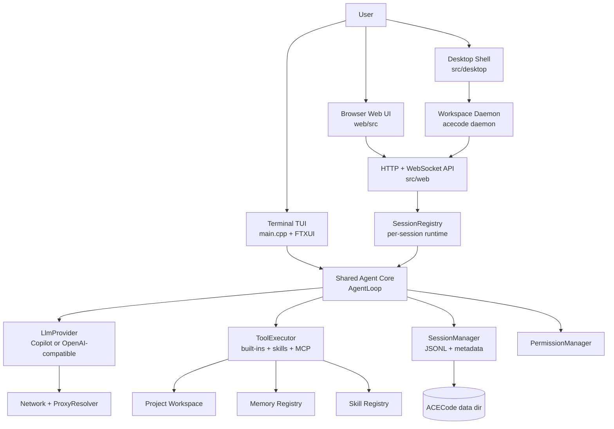
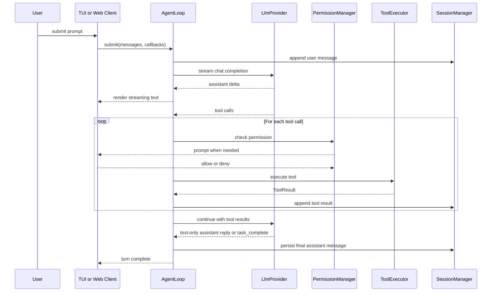
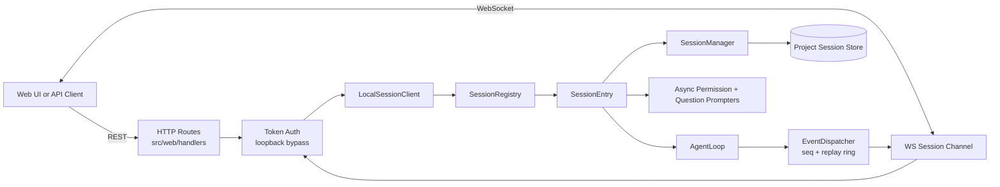
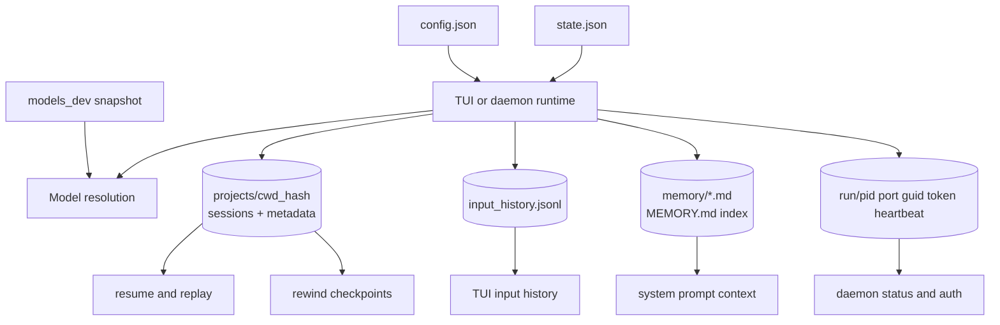

# ACECode Architecture

ACECode has one shared agent core with several runtime surfaces around it: terminal TUI, daemon API, bundled web UI, Windows service mode, and the optional desktop shell. This document is the durable map of those parts. Implementation notes that change more often live in [CLAUDE.md](CLAUDE.md).

## Runtime Surfaces

| Surface | Entry point | Role |
| --- | --- | --- |
| Terminal TUI | [main.cpp](main.cpp) | Interactive shell experience with FTXUI rendering, slash commands, permission prompts, and local session work. |
| Daemon worker | [src/daemon/](src/daemon) | Background process that owns config, sessions, agent loops, heartbeat files, auth token, and termination handling. |
| HTTP/WebSocket API | [src/web/](src/web) | Crow server exposing health, sessions, messages, files, skills, MCP, models, and live session events. |
| Web frontend | [web/](web) | React/Vite/Tailwind UI served by the daemon from embedded or filesystem assets. |
| Windows service | [src/daemon/service_win.cpp](src/daemon/service_win.cpp) | SCM wrapper for running the daemon before login with a service data directory. |
| Desktop shell | [src/desktop/](src/desktop) | Optional webview shell that manages multiple workspace daemons and native desktop integration. |

## Architecture Diagrams

### System Topology



### Agent Turn Flow



### Daemon And Web Event Flow



### Persistence Map



## Source Ownership

| Area | Ownership |
| --- | --- |
| [main.cpp](main.cpp) | TUI entry point, CLI option parsing for interactive mode, provider/tool setup, FTXUI event loop, and terminal-specific UI wiring. |
| [src/agent_loop.cpp](src/agent_loop.cpp) and [src/agent_loop.hpp](src/agent_loop.hpp) | Multi-turn agent state machine, streaming callbacks, tool-call loop, cancellation, max-iteration handling, and completion semantics. |
| [src/provider/](src/provider) | `LlmProvider` implementations, provider factory/swap logic, Copilot auth integration, OpenAI-compatible streaming, model profiles, and context-window resolution. |
| [src/tool/](src/tool) | Tool registry, built-in tools, tool result metadata, summaries, MCP bridge, skills tools, memory tools, and optional web-search tool. |
| [src/permissions.hpp](src/permissions.hpp) | Permission modes and glob-style tool/path allow rules. |
| [src/session/](src/session) | Session JSONL persistence, metadata sidecars, replay, resume restore, rewind checkpoints, daemon session registry, and event dispatch. |
| [src/commands/](src/commands) | Slash command registry and built-in command implementations. |
| [src/config/](src/config) | Config load/save/validation, saved model profiles, and default schema behavior. |
| [src/skills/](src/skills) | Skill discovery, command registration, lazy skill body loading, default skill seeding, and skill invocation hints. |
| [src/memory/](src/memory) | Persistent user memory registry and memory file lifecycle. |
| [src/project_instructions/](src/project_instructions) | Configurable project-instruction discovery and prompt injection. |
| [src/history/](src/history) | Per-working-directory input history storage. |
| [src/daemon/](src/daemon) | Foreground/detached/service daemon launch, runtime files, heartbeat, process supervision, and worker lifecycle. |
| [src/web/](src/web) | HTTP routes, WebSocket envelopes, payload codecs, auth, static assets, and web-specific handlers. |
| [src/desktop/](src/desktop) | Workspace registry, daemon pool, native webview host, tray, notifications, and desktop bridge. |
| [src/tui/](src/tui) and [src/markdown/](src/markdown) | Reusable TUI helpers, markdown rendering, overlays, progress rendering, scroll helpers, and terminal render mode helpers. |
| [src/network/](src/network) | Proxy resolution, proxy probing, and shared networking configuration. |
| [src/utils/](src/utils) | Shared filesystem, encoding, logging, state, token, UUID, hashing, stream, and terminal helpers. |
| [tests/](tests) | GoogleTest coverage for headless logic through `acecode_testable`. |

## Terminal Turn Flow

```text
User input
  -> TUI command/input handling
  -> AgentLoop::submit
  -> LlmProvider streaming request
  -> assistant text and/or tool calls
  -> PermissionManager decision
  -> ToolExecutor execution
  -> tool result appended to conversation
  -> next provider request until assistant text-only completion or explicit task_complete
```

The TUI keeps rendering state in `TuiState`; callbacks from the worker side post events back to the FTXUI loop. Read-only tools are normally auto-approved. Write and exec tools prompt unless permission mode or rules allow them.

## Daemon And Web Flow

```text
acecode daemon start
  -> spawn detached worker
  -> load config and resolve data dir
  -> write pid/port/guid/token/heartbeat files
  -> create SessionRegistry and WebServer
  -> serve REST, WebSocket, and static frontend assets
```

Each daemon session owns its own `SessionManager`, `PermissionManager`, `AgentLoop`, async permission prompter, and question prompter. `EventDispatcher` assigns monotonic sequence numbers and keeps a bounded replay buffer so WebSocket clients can reconnect without losing recent frames.

Loopback clients can skip daemon auth. Non-loopback clients must provide the daemon token, and non-loopback dangerous mode is rejected. Full protocol details live in [docs/daemon-api.md](docs/daemon-api.md).

## Persistence

| Data | Location |
| --- | --- |
| User config | `~/.acecode/config.json` for normal user mode. |
| Service config/data | Platform service data directory in service mode. |
| Sessions | `~/.acecode/projects/<cwd_hash>/` with JSONL messages and metadata sidecars. |
| Rewind checkpoints | Project session storage associated with user turns. |
| Input history | Per-project JSONL history independent of session messages. |
| Memory | `~/.acecode/memory/` with indexed Markdown entries. |
| Runtime daemon files | `<data_dir>/run/` for pid, port, guid, token, and heartbeat. |
| State | `~/.acecode/state.json` for small cross-session flags and caches. |
| Bundled model catalog | `assets/models_dev/` at source time, installed under `share/acecode/models_dev`. |

Session serialization intentionally keeps runtime-only UI fields out of persisted messages. Resume paths rebuild display rows and tool previews from persisted canonical messages and metadata.

## Providers And Models

ACECode supports GitHub Copilot and OpenAI-compatible endpoints through a shared `LlmProvider` interface. Model selection can come from legacy provider fields, named `saved_models`, a global default, per-project overrides, or resumed session metadata.

Context-window resolution uses saved profile data, bundled models.dev metadata, provider defaults, and configured fallbacks. See [docs/model-context-resolution.md](docs/model-context-resolution.md).

## Tools And Permissions

`ToolExecutor` owns the authoritative tool registry. Built-ins include shell execution, file read/write/edit, grep, glob, task completion, structured user questions, skills, memory, optional web search, and MCP-provided tools.

Permission behavior is centralized in [src/permissions.hpp](src/permissions.hpp):

- `Default`: auto-allow read-only tools, prompt for writes and exec.
- `AcceptEdits`: auto-allow file writes/edits, still prompt for shell commands.
- `Yolo`: allow all tools.

Memory writes are path-locked to the memory directory even when broader permissions are enabled.

## Extension Points

- Add a slash command under [src/commands/](src/commands), then register it in the command registry.
- Add a tool under [src/tool/](src/tool), return structured `ToolResult` metadata when useful, and register it where TUI/daemon tools are initialized.
- Add provider behavior under [src/provider/](src/provider), keeping model profile and context-resolution rules centralized.
- Add daemon routes under [src/web/handlers/](src/web/handlers) and register them in [src/web/server.cpp](src/web/server.cpp).
- Add frontend behavior under [web/src/](web/src); rebuild `web/dist/` before embedding.
- Add focused unit tests under [tests/](tests), mirroring source paths with `_test.cpp` file names.

## Build Targets

| Target | Purpose |
| --- | --- |
| `acecode_testable` | Object library containing headless reusable logic for production binaries and tests. |
| `acecode` | Main terminal/daemon executable. |
| `acecode_unit_tests` | GoogleTest binary when `BUILD_TESTING=ON`. |
| `acecode-desktop` | Optional desktop shell when `ACECODE_BUILD_DESKTOP=ON`. |

The CMake build embeds `web/dist/` into generated C++ asset data. If the web build is absent, a minimal fallback page is embedded so API builds still work.

## Reference Docs

- [README.md](README.md) and [README_CN.md](README_CN.md): user-facing overview, setup, run modes, and build entry points.
- [AGENTS.md](AGENTS.md): repository rules for coding agents and contributors.
- [CLAUDE.md](CLAUDE.md): implementation memory for current subsystem notes.
- [docs/user-manual.md](docs/user-manual.md): user workflow details.
- [docs/daemon-api.md](docs/daemon-api.md): daemon HTTP/WebSocket protocol.
- [docs/model-context-resolution.md](docs/model-context-resolution.md): model and context-window behavior.
- [docs/skills.md](docs/skills.md) and [docs/skills-implementation.md](docs/skills-implementation.md): skills usage and implementation.
- [docs/desktop-shell/multi-workspace.md](docs/desktop-shell/multi-workspace.md): desktop multi-workspace design.
